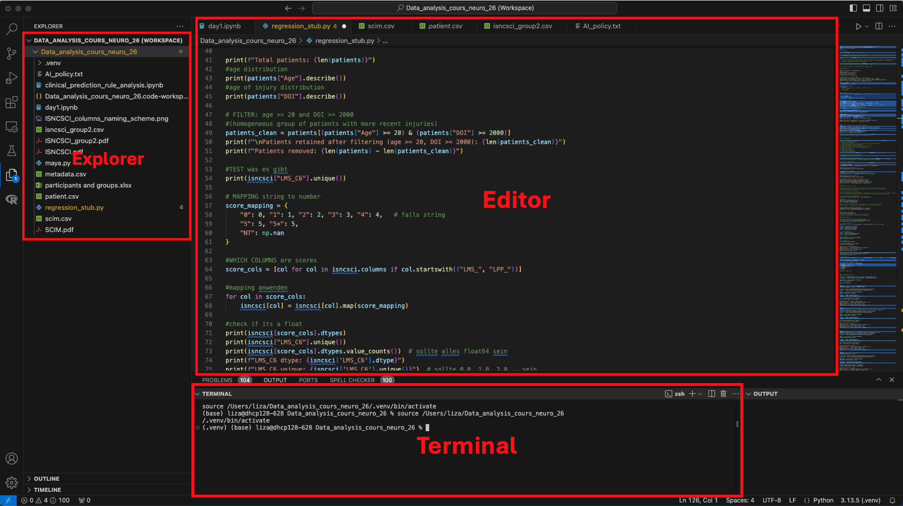

## Aufbau & Kursmaterialien

Herzlich willkommen! Dieser Kurs ist in zwölf Themenabschnitte gegliedert, die dich schrittweise in die Welt der Datenanalyse mit R oder Python einführen.

Auf dieser Plattform findest du alles an einem Ort: verständliche Erklärungen, direkt ausführbare Code-Beispiele zum Experimentieren und kurze Wissenstests nach jedem Kapitel, um das Gelernte zu festigen. 

Dabei hast du die volle Wahlfreiheit: Über den **Button oben rechts** kannst du jederzeit zwischen den Programmiersprachen **R** und **Python** wechseln. Die fachlichen Inhalte sind dabei identisch – du entscheidest, mit welchem Werkzeug du arbeiten möchtest.

Zusätzlich sind alle Vorlesungsfolien sowie Markdown-Dateien mit demselben Inhalt verlinkt, damit du die Materialien auch eigenständig offline durcharbeiten kannst.

---

## Programmiersprachen und ihre Arbeitsumgebungen

Bevor wir starten, ist es wichtig, den Unterschied zwischen der **Programmiersprache** selbst und dem **Programm**, in dem wir schreiben, zu verstehen.

### 1. Die Sprache: R und Python
**R** und **Python** sind die "Motoren" hinter deiner Analyse. Damit dein Computer versteht, was du von ihm willst, musst du die Sprache als Basis-Software herunterladen.

* **Python:** Wird als Programm von [python.org](https://www.python.org/) installiert. 
* **R:** Wird als "Base R" vom [CRAN-Netzwerk](https://cran.r-project.org/) installiert.

**Wichtig:** Du wirst diese Programme fast nie direkt öffnen. Sie "ruhen" im Hintergrund deines Betriebssystems und warten auf Befehle.

### 2. Das Werkzeug: Die IDE (RStudio & VS Code)
Um den Code tatsächlich zu schreiben, nutzen wir eine **IDE** (*Integrated Development Environment*). Das ist deine eigentliche Schaltzentrale.

* **RStudio** ist die Standard-Umgebung für **R**.
* **VS Code** ist die beliebteste Umgebung für **Python**.


---

## Was brauchst du für die Einrichtung?

Wenn du später auf deinem eigenen Rechner arbeiten möchtest, ist dies die richtige Reihenfolge:

1. **Den Motor installieren:** Lade Python oder R herunter (stellt die "Sprache" bereit).
2. **Das Büro einrichten:** Installiere eine IDE wie RStudio oder VS Code (dein Arbeitsplatz).
3. **Werkzeuge auspacken:** Installiere innerhalb der IDE sogenannte "Packages". Das sind Erweiterungen für spezielle Aufgaben, wie das Zeichnen biologischer Diagramme.

::: {.callout-tip}
## Unser Tipp für den Kursstart
Zum Bearbeiten der Aufgaben auf dieser Website wird **kein installiertes RStudio oder VS Code benötigt**. Unsere interaktiven Fenster haben alles bereits "an Bord". Wir empfehlen dir jedoch, dich im Laufe des Kurses mit diesen Programmen zu beschäftigen, da sie in der späteren Praxis deine täglichen Begleiter sein werden!
:::

---

## Arbeiten mit Markdown 

In diesem Kurs verwenden wir keine gewöhnlichen Textdokumente oder reinen Programmcode. Zusätzlich zu dieser Website arbeiten wir als Offline-Alternative mit **Markdown**-Files. 

In der Wissenschaft ist die **Reproduzierbarkeit** (Nachvollziehbarkeit) entscheidend. Markdown erlaubt uns das sogenannte **Literate Programming**:
* Wir schreiben unseren Text (Erklärungen, Hypothesen).
* Wir betten den echten Code (R oder Python) direkt darin ein.
* Wir lassen den Computer das Dokument **rendern** (in RStudio oft über den Button **Knit**).

Das Ergebnis ist ein fertiges Dokument (HTML, PDF oder Word), in dem der Text, der Code und die daraus entstandenen Grafiken perfekt kombiniert sind.


### Der Aufbau einer Datei
1. **Der Text:** Normaler Text mit einfacher Formatierung (`**fett**`, `*kursiv*`, `# Überschrift`).
2. **Die Code-Chunks:** Blöcke, die mit drei Backticks beginnen. Hier wird der eigentliche Code ausgeführt. Es empfiehlt sich, jeden Chunk zu **benennen** – das hält dein Dokument übersichtlich und erleichtert die Fehlersuche erheblich.
3. **Der YAML-Header:** Der Bereich ganz oben zwischen den `---` Linien für Titel und Autor.

---

::: {.callout-note}
## Sprachspezifische Einführung
Je nachdem, ob du oben auf "R" oder "Python" geschaltet hast, siehst du unten jetzt eine genauere Einführung in die jeweilige Umgebung. 
:::

::: {.lang-r}

## Fokus: R und RStudio

**R** ist eine mächtige Sprache für die statistische Datenanalyse. Wir empfehlen dir, ergänzend die Einführungskurse bei **DataCamp** zu besuchen, um ein Gefühl für die Syntax zu bekommen.
**RStudio** ist eine "Integrierte Entwicklungsumgebung" (IDE), die dir hilft, Code zu schreiben, Daten zu visualisieren und Ergebnisse zu speichern.

### Die RStudio Oberfläche
Die Oberfläche ist in vier Hauptbereiche unterteilt:

1.  **Source (Oben links):** Hier schreibst du deine Skripte und Markdown-Dateien. Um eine neue Datei zu erstellen, klicke auf das `New File` Icon (grünes Plus) oben links. Alles, was hier steht, kann gespeichert werden.
2.  **Console (Unten links):** Hier wird Code sofort ausgeführt. Tippe zum Beispiel `3 + 4` ein und drücke Enter – das Ergebnis erscheint sofort. Die Console ist ideal für Befehle, die du nicht dauerhaft speichern musst.
3.  **Environment (Oben rechts):** Hier werden alle Variablen, Listen und Datensätze angezeigt, die du während deiner Sitzung erstellt und definiert hast.
4.  **Files/Plots/Help (Unten rechts):** Hier verwaltest du deine Dateien, betrachtest erzeugte Grafiken oder suchst in der Hilfe nach Funktionen (z.B. mit `?matrix`).

{fig-align="center" width=100%}

### Erste Schritte in der Programmierung

* **Zuweisungen:** Werte werden mit `<-` oder `=` in Variablen geladen (z. B. `a <- 10`). Danach erscheint die Variable im Environment.
* **R als Taschenrechner:** R eignet sich hervorragend für mathematische Berechnungen. Du kannst Variablen direkt miteinander verrechnen:

```{shinylive-r}
#| standalone: true
#| viewerHeight: 300
library(shiny)
ui <- fluidPage(
  textAreaInput("code", "R Chunk: Mathematische Operationen", value = "x <- 5\ny <- 3\nSumme <- x + y\nSumme * 5", width = '100%', height = '100px'),
  actionButton("run", "Run Code", class = "btn-success"),
  verbatimTextOutput("out")
)
server <- function(input, output) {
  observeEvent(input$run, { output$out <- renderPrint({ eval(parse(text = input$code)) }) })
}
shinyApp(ui, server)
```

* **Case Sensitivity:** R ist extrem pingelig. `hello` ist eine andere Variable als `Hello`.
* **Hilfe finden:** Nutze die Dokumentation direkt in RStudio oder Online-Ressourcen:
    * [guru99 R Tutorial](https://www.guru99.com/r-tutorial.html)
    * [Babraham Bioinformatics](https://www.bioinformatics.babraham.ac.uk/training.html#advancedrtidy)
    * [R for Data Science](https://r4ds.had.co.nz)
    
* **Workspace:** Mit `ls()` listest du deine Variablen auf, mit `rm(a)` löschst du sie – **Achtung:** `rm()` löscht unwiderruflich, also mit Bedacht einsetzen! Dein gesamtes Environment kann als `.RData`-Datei gespeichert werden und in einer späteren Sitzung mit `load("MeinEnvironment.RData")` wiederhergestellt werden.
* **Working Directory:** Über den Reiter **Files -> More -> Set As Working Directory** definierst du, in welchem Ordner R nach deinen Dateien suchen soll.

#### Hilfreiche Tipps im Editor
* **Autovervollständigung:** In RStudio erscheinen Anführungszeichen `""` und Klammern `()` meist automatisch paarweise. Das hilft dir, Syntaxfehler durch vergessene Zeichen zu vermeiden.
* **Historie:** Mit den **Pfeiltasten (hoch/runter)** kannst du in der Console durch deine zuletzt verwendeten Befehle blättern.
* **Kommentare:** Alles, was nach einem `#` steht, wird von R ignoriert. Nutze dies großzügig, um deinen Code für dich und andere zu erklären.

#### Variablen & Zuweisungen (Assignments)
Wir können Werte (Zahlen oder Text) in Variablen laden. In R nutzt man dafür traditionell den Pfeil `<-`, aber auch das `=` ist möglich.
```{shinylive-r}
#| standalone: true
#| viewerHeight: 300
library(shiny)
ui <- fluidPage(
  textAreaInput("code", "R Chunk: Variablen & Zuweisungen", value = "a <- \"Hello world!\"\nhello = \"Hello world!\"\nprint(a)\nprint(hello)", width = '100%', height = '120px'),
  actionButton("run", "Run Code", class = "btn-success"),
  verbatimTextOutput("out")
)
server <- function(input, output) {
  observeEvent(input$run, { output$out <- renderPrint({ eval(parse(text = input$code)) }) })
}
shinyApp(ui, server)llo = "Hello world!"
```
:::

::: {.lang-python}

## Python und VS Code
**Python** ist eine vielseitige und weit verbreitete Programmiersprache, die sich besonders gut für Datenanalyse, maschinelles Lernen und wissenschaftliches Rechnen eignet. Wir empfehlen dir, ergänzend die Einführungskurse bei DataCamp zu besuchen, um ein Gefühl für die Syntax zu bekommen.
VS Code ist eine flexible Entwicklungsumgebung (IDE), die durch Erweiterungen (Extensions) für Python optimal angepasst werden kann.

### Die VS Code Oberfläche
Die Oberfläche ist in vier Hauptbereiche unterteilt:

1.  **Editor (Mitte):** Hier schreibst du deine Skripte und Notebooks. Um eine neue Datei zu erstellen, klicke auf das New File Icon oben links im Explorer. Alles, was hier steht, kann gespeichert werden. Die Endungen der Dateien bestimmen in welcher Programmiersprache geschrieben wird und wie die Datei verwendet werden kann (.py/.ipynb für Python, .r für R, .md für Markdown).
2.  **Terminal (Unten):** Hier wird Code sofort ausgeführt und Dateien können gestartet werden. Verbindungen zu Clustern, Kommunikation mit Github oder Suchen von Dateien funktioniert ebenfalls über das Terminal. Geöffnet wird das Terminal zum Beispiel ganz oben rechts (3. Symbol von rechts). 
3.  **Explorer (Links):** Hier verwaltest du deine Dateien und Ordner. Diese sind entweder lokal auf deinem Rechner gespeichert oder auf einem Cluster. 
4. **Kontrollzentrum (ganz links):** Hier kannst du zum Beispiel in Dokumenten nach einem SChlagwort suchen, Github repositories verbinden und verwalten, debuggen, Erweiterungen installieren, Remote verbindungen (zB Cluster) verwalten.

{fig-align="center" width=100%}

### Erste Schritte in der Programmierung

* **Zuweisungen:** Werte werden in Python mit = in Variablen geladen (z. B. a = 10). Anders als in R gibt es in Python kein <-.
* **Python als Taschenrechner:** Python eignet sich hervorragend für mathematische Berechnungen. Du kannst Variablen direkt miteinander verrechnen:

```{shinylive-python}
#| standalone: true
#| viewerHeight: 300
from shiny import App, ui, render, reactive
import io, contextlib

app_ui = ui.page_fluid(
    ui.input_text_area("code", "Python Chunk: Mathematische Operationen", value="x = 5\ny = 3\nSumme = x + y\nprint(Summe * 5)", width='100%', height='100px'),
    ui.input_action_button("run", "Run Code", class_="btn-success"),
    ui.output_text_verbatim("out")
)

def server(input, output, session):
    @render.text
    @reactive.event(input.run)
    def out():
        f = io.StringIO()
        with contextlib.redirect_stdout(f):
            exec(input.code(), {})
        return f.getvalue()

app = App(app_ui, server)
```

* **Case Sensitivity:** Python ist genauso pingelig wie R. hello ist eine andere Variable als Hello.

### Hilfe finden: 
Nutze die Dokumentation direkt in VS Code oder Online-Ressourcen:
Python Dokumentation
W3Schools Python Tutorial
Python for Data Science Handbook

* **Workspace:** Mit dir() listest du alle aktuellen Variablen und Objekte auf, mit del a löschst du eine Variable – Achtung: del löscht unwiderruflich, also mit Bedacht einsetzen! 

* **Working Directory:** Mit import os und os getcwd() kannst du das aktuelle Verzeichnis anzeigen, mit os.chdir("pfad/zum/ordner") wechselst du es.

### Hilfreiche Tipps im Editor

* **Autovervollständigung:** VS Code schlägt dir automatisch Funktionen, Variablennamen und Klammern vor. Anführungszeichen "" und Klammern () erscheinen oft automatisch paarweise – das hilft, Syntaxfehler zu vermeiden.
* **Historie:** Im Terminal kannst du mit den Pfeiltasten (hoch/runter) durch deine zuletzt verwendeten Befehle blättern.
* **Kommentare:** Alles, was nach einem # steht, wird von Python ignoriert – genau wie in R. Nutze Kommentare großzügig, um deinen Code zu erklären.

### Variablen & Zuweisungen (Assignments)
Wir können Werte (Zahlen oder Text) in Variablen laden. In Python wird ausschließlich = für Zuweisungen verwendet.

```{shinylive-python}
#| standalone: true
#| viewerHeight: 300
from shiny import App, ui, render, reactive
import io, contextlib

app_ui = ui.page_fluid(
    ui.input_text_area("code", "Python Chunk: Variablen & Zuweisungen", value='a = "Hello world!"\nhello = "Hello world!"\nprint(a)\nprint(hello)', width='100%', height='120px'),
    ui.input_action_button("run", "Run Code", class_="btn-success"),
    ui.output_text_verbatim("out")
)

def server(input, output, session):
    @render.text
    @reactive.event(input.run)
    def out():
        f = io.StringIO()
        with contextlib.redirect_stdout(f):
            exec(input.code(), {})
        return f.getvalue()

app = App(app_ui, server)
```
:::
